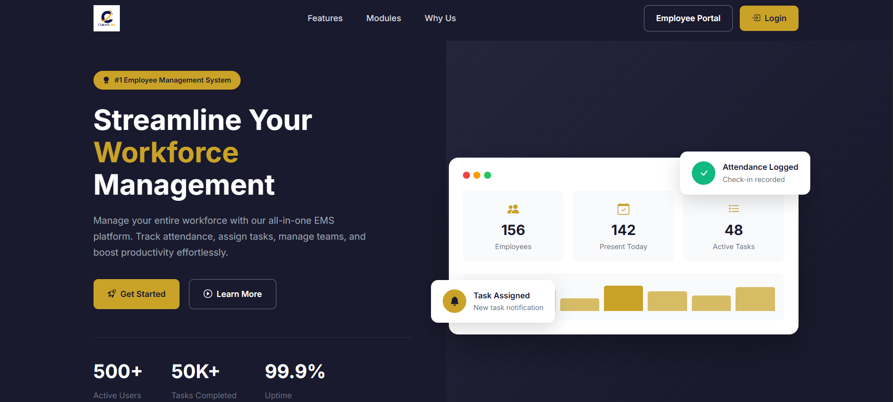

# EMS Dashboard - Employee Management System



A comprehensive, role-based Employee Management and Human Resource Management System built with PHP, MySQL, and Bootstrap. Designed for organizations to efficiently manage employees, attendance, tasks, and approvals.

## 🚀 Features

### Core Features

#### 1. **Role-Based Access Control**
- **Admin**: Full system control, employee management, domain management, settings
- **HR/Manager**: Attendance approval, employee management, reports generation
- **Team Lead**: Team management, task assignment, attendance tracking
- **Employee**: Self-service dashboard, task management, attendance tracking

#### 2. **Employee Management**
- Add, edit, and delete employee records
- Employee ID auto-generation based on domain and designation
- Avatar/profile picture management
- Domain and designation assignment
- Employee status tracking (Active, Inactive, Terminated)
- Role assignment (Admin, Manager, HR, Team Lead)
- Team lead assignment for hierarchical structure
- Check-in requirement configuration

#### 3. **Attendance Tracking**
- Employee check-in/check-out system
- Daily attendance records with timestamps
- Total hours calculation
- Attendance status (Approved, Pending, Rejected)
- Monthly and yearly attendance reports
- Attendance trends visualization (Bar charts)
- Attendance approval workflow
- Attendance history and records

#### 4. **Task Management**
- Create and assign tasks to employees
- Task priority levels (Low, Medium, High, Critical)
- Task status tracking (Not Started, In Progress, Completed, Overdue, Changes Requested)
- Deadline management
- Task assignment by managers and team leads
- Personal task dashboard for employees
- Task completion tracking and analytics

#### 5. **Approval Workflow**
- Pending attendance approvals for managers
- Approval/rejection with comments
- Approval history tracking
- Status notifications

#### 6. **Reports & Analytics**
- **Attendance Reports**: Monthly summaries, daily records, employee-wise analytics
- **Task Reports**: Completion rates, task distribution, performance metrics
- **Employee Reports**: Directory, domain-wise breakdown
- **Domain Reports**: Employee counts, attendance metrics, task analytics
- Export to CSV and PDF formats
- Date range filtering
- Domain-based filtering

#### 7. **User Profiles**
- Personal profile management
- Avatar/picture upload
- Contact information management
- Password change functionality
- Profile visibility by role

#### 8. **Dashboard & Notifications**
- Role-specific customized dashboards
- Real-time statistics cards
- Welcome banners with date and time
- Activity logs
- Notification system
- Quick action buttons

#### 9. **Domain Management**
- Create and manage departments/domains
- Domain code assignment
- Domain status management
- Domain-based employee grouping

#### 10. **Settings & Administration**
- System configuration
- Email settings
- PDF generator configuration
- User activity logs
- Database management

### UI/UX Features

- **Modern, Responsive Design**: Works on desktop, tablet, and mobile devices
- **Dark-themed Interface**: Eye-friendly, professional appearance
- **Gradient Buttons**: `.btn-glow` class for highlighted actions
- **Tabbed Navigation**: Clean report section navigation
- **Card-based Layouts**: Well-organized content sections
- **Progressive Visualization**: Charts and graphs for data analysis
- **Status Badges**: Color-coded status indicators
- **Modal Dialogs**: Confirmation dialogs for critical actions
- **Form Validation**: Client and server-side validation
- **Tooltips & Hints**: Contextual help throughout the application

## 📋 System Requirements

- **PHP**: 7.4 or higher
- **MySQL**: 5.7 or higher
- **Web Server**: Apache with mod_rewrite
- **Storage**: Minimum 100MB for initial setup
- **Memory**: 128MB PHP memory limit recommended

## 🛠️ Technology Stack

- **Backend**: PHP 7.4+
- **Database**: MySQL 5.7+
- **Frontend**: HTML5, CSS3, JavaScript
- **Framework**: Bootstrap 5
- **Charts**: Chart.js for data visualization
- **Icons**: Bootstrap Icons
- **PDF Generation**: TCPDF
- **Email**: PHPMailer
- **File Upload**: Safe file handling with validation

## 📁 Project Structure

```
ems-dashboard/
├── admin/                    # Admin panel files
│   ├── dashboard.php
│   ├── employees.php
│   ├── domains.php
│   ├── attendance.php
│   ├── approvals.php
│   ├── reports.php
│   ├── tasks.php
│   ├── activity-logs.php
│   ├── settings.php
│   └── profile.php
├── manager/                  # Manager/HR interface
│   ├── dashboard.php
│   ├── employees.php
│   ├── attendance.php
│   ├── approvals.php
│   ├── reports.php
│   ├── tasks.php
│   ├── my-attendance.php
│   ├── my-tasks.php
│   ├── profile.php
│   └── checkin.php
├── teamlead/                 # Team Lead interface
│   ├── dashboard.php
│   ├── team.php
│   ├── team-attendance.php
│   ├── team-reports.php
│   ├── team-tasks.php
│   ├── my-attendance.php
│   ├── my-tasks.php
│   ├── approvals.php
│   ├── profile.php
│   └── checkin.php
├── employee/                 # Employee portal
│   ├── dashboard.php
│   ├── attendance.php
│   ├── checkin.php
│   ├── tasks.php
│   ├── notifications.php
│   ├── profile.php
│   └── ...
├── config/                   # Configuration files
│   ├── config.php
│   ├── database.php
│   ├── mailer.php
│   └── pdf-generator.php
├── includes/                 # Shared templates
│   ├── header.php
│   ├── footer.php
│   ├── admin-sidebar.php
│   ├── manager-sidebar.php
│   ├── teamlead-sidebar.php
│   └── employee-sidebar.php
├── assets/                   # Static files
│   ├── css/
│   │   └── style.css
│   ├── js/
│   │   └── main.js
│   └── img/
├── database/                 # Database files
│   └── ems_dashboard.sql
├── uploads/                  # User uploads
│   ├── avatars/
│   └── checkin/
├── vendor/                   # Composer dependencies
├── index.php                 # Home page
├── login.php                 # Login page
├── logout.php                # Logout handler
├── forgot-password.php       # Password recovery
└── reset-password.php        # Password reset
```

## 🔧 Installation

### Prerequisites
- XAMPP, WAMP, or similar local development environment
- Composer installed

### Steps

1. **Download the project** into your web root directory
   ```bash
   cd htdocs
   git clone <repository-url> ems-dashboard
   cd ems-dashboard
   ```

2. **Install dependencies**
   ```bash
   composer install
   ```

3. **Create database**
   - Open phpMyAdmin
   - Create a new database (e.g., `ems_dashboard`)
   - Import `database/ems_dashboard.sql`

4. **Configure the application**
   - Copy `config/config.php.example` to `config/config.php`
   - Update database credentials in `config/database.php`
   - Set base URL in `config/config.php`

5. **Set file permissions**
   ```bash
   chmod -R 755 uploads/
   chmod -R 755 assets/
   ```

6. **Access the application**
   - Open `http://localhost/ems-dashboard`
   - Default credentials:
     - Email: `admin@ems.com`
     - Password: `password` (Change immediately!)

## 📊 Database Schema

### Main Tables
- **employees**: Employee records with personal details
- **attendance**: Daily attendance records with check-in/out times
- **tasks**: Task assignments and tracking
- **approvals**: Attendance approval workflow
- **domains**: Department/domain management
- **roles**: User roles (Admin, Manager, HR, Team Lead)
- **notifications**: System notifications
- **activity_logs**: User activity tracking
- **roles_permissions**: Role-based access control

## 🔐 Security Features

- **Password Hashing**: bcrypt password hashing
- **SQL Injection Prevention**: Prepared statements
- **XSS Protection**: HTML escaping and sanitization
- **CSRF Protection**: Token-based CSRF protection
- **Session Management**: Secure session handling
- **Role-Based Access Control (RBAC)**: Granular permission system
- **File Upload Validation**: Type and size validation
- **Input Validation**: Server-side validation for all inputs

## 📱 Responsive Design

- Mobile-first approach
- Works on all screen sizes
- Touch-friendly interface
- Optimized for tablets and smartphones

## 🎨 Customization

### Adding New Roles
1. Add role in admin settings
2. Create role-specific sidebar in `includes/`
3. Create role-specific dashboard in new folder
4. Update permission checks in `config/config.php`

### Modifying Reports
- Edit report generation queries in respective role dashboards
- Customize report templates in `includes/`
- Update CSV/PDF export formats

### Styling
- Main stylesheet: `assets/css/style.css`
- Bootstrap classes available throughout
- Custom CSS variables for theming

## 🚀 Deployment

Refer to `DEPLOY.md` for detailed deployment instructions for Hostinger and other hosting providers.

## 📝 Usage

### For Admins
1. Dashboard: Overview of all system activities
2. Employees: Manage all employee records
3. Domains: Create and manage departments
4. Attendance: Review all attendance records
5. Reports: Generate comprehensive reports
6. Settings: Configure system settings

### For Managers/HR
1. Dashboard: View team statistics and pending approvals
2. Employees: Manage assigned employees
3. Approvals: Approve/reject attendance requests
4. Reports: Generate team/department reports
5. Tasks: Create and assign tasks

### For Team Leads
1. Dashboard: Team overview and statistics
2. My Team: Manage team members
3. Team Attendance: Track team attendance
4. Team Tasks: Assign and track tasks
5. Approvals: Approve team member attendance

### For Employees
1. Dashboard: Personal statistics and tasks
2. Check-in: Mark attendance
3. My Attendance: View personal attendance
4. My Tasks: View assigned tasks
5. Profile: Update personal information

## 🐛 Troubleshooting

### Common Issues

**1. Database Connection Error**
- Verify MySQL is running
- Check credentials in `config/database.php`
- Ensure database exists

**2. File Upload Issues**
- Check folder permissions (755)
- Verify file size limits in php.ini
- Check available disk space

**3. Session Timeout**
- Adjust session timeout in `config/config.php`
- Clear browser cache and cookies

**4. Email Not Sending**
- Verify SMTP settings in `config/mailer.php`
- Check email credentials
- Review error logs

## 📧 Support

For issues, questions, or suggestions, please contact the development team or check the documentation.

## 📄 License

This project is proprietary software. All rights reserved.

## 🙏 Credits

Built with:
- Bootstrap 5
- Chart.js
- Bootstrap Icons
- PHPMailer
- TCPDF

---

**Version**: 1.0.0  
**Last Updated**: December 13, 2025  
**Status**: Production Ready
